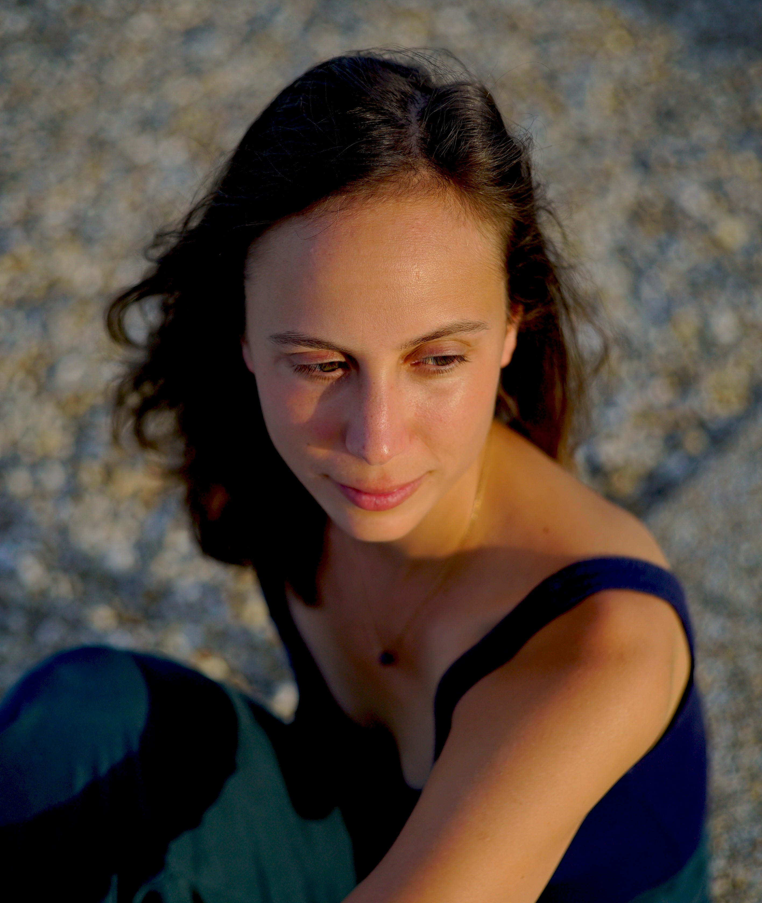

## was mich bewegt

Die Erfahrung von Freude und Extase.
Eine Verbindung zu meinen Emotionen - zu jeder einzelnen.
Das elegante Zusammenspiel von Bewegungen, Körperempfindungen, Emotionen und Gedanken.
Staunen, jeden Tag aufs Neue.
Das Gefühl, so richtig lebendig zu sein.
Die einfachste, kleinste Bewegung.
Eine Empfindung, wahr und im Moment.
Jede neue Information.
All das Unbekannte.
Die Fülle an Erfahrung.
Inspiration durch Poesie.
Authentischer Ausdruck.
Leidenschaft und Hingabe.
Neugier und Sehnsucht.
Empfangen und Anbieten.

## was mich bewegt hat

- Tanztherapie mit Kindern in Schulen und im voll betreuten Wohnen & mit Erwachsenen in der forensischen Psychiatrie
- Master of Arts in Dance Movement Psychotherapy, Goldsmiths University London
- Master of Science in Psychologie, Universität Wien
- performing artist bei [.EVOLve Theatre Company](https://evolve-esntheatrecompany.net/)

<!--  -->

