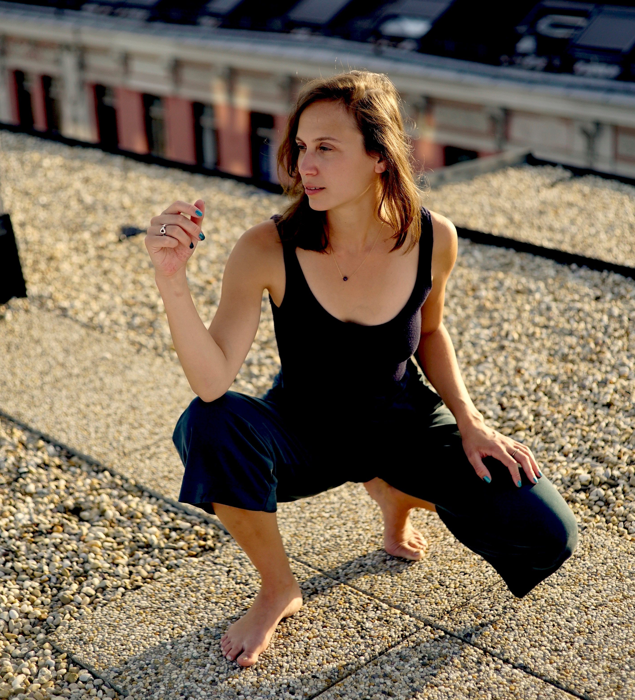
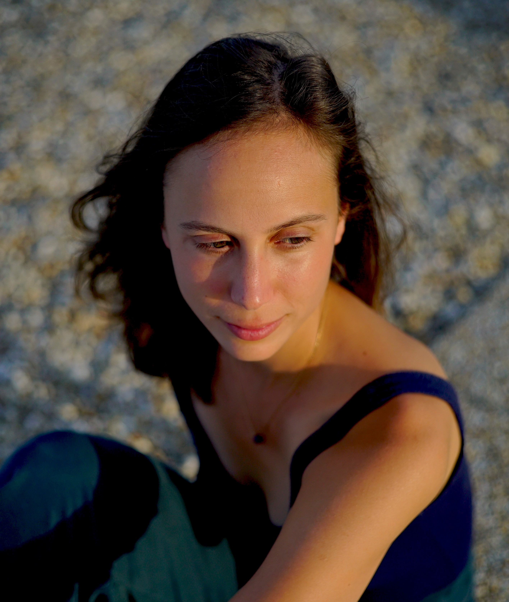

## what moves me

I am here to support you in living your full expression, to explore your desires & what holds you back from fulfilling them - through movement, dance and the rhythm of your heart. With curiosity and devotion, we lean in to your truth and find trust in your intuition.

## how I got here

- working with children in schools & adults in mental health care
- MA in Dance Movement Psychotherapy, Goldsmiths University London
- MSc in Psychology, University of Vienna
- performing artist with [.EVOLve Theatre Company](https://evolve-esntheatrecompany.net/)

